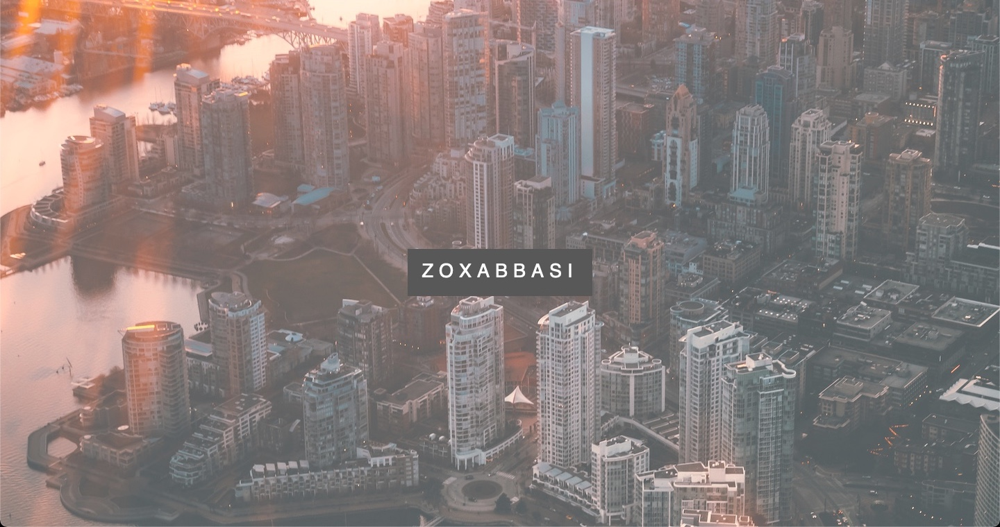

# Parallex Website | zoxAbbasI

In this project I  created a Parallex website.

## Table of contents

- [Overview](#overview)
  - [Screenshot](#screenshot)
  - [Links](#links)
- [My process](#my-process)
  - [Built with](#built-with)
- [Author](#author)

## Overview

### Screenshot

### Links

- Live Site URL: [Parallex Website](https://zoxabbasi.github.io/parallex-website/)

## My process

- Using CSS to style the page.
- Using multiples HTML elements for styling purposess.

### Built with

- Semantic HTML5 markup
- CSS custom properties

## Author

- Website - [Talal Abbasi](https://zoxabbasi.github.io/)
- Twitter - [@zoxabbasi](https://www.twitter.com/zoxabbasi)
